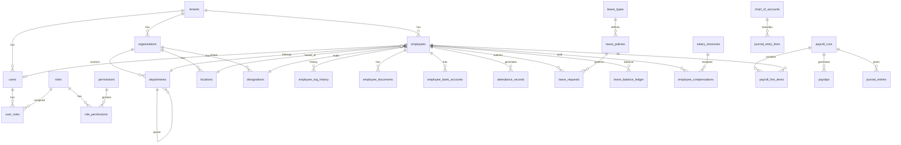

# HR Shakya ERP — MongoDB Database Design

**Project:** HR Shakya ERP Platform  
**Engine:** MongoDB 7.x+  
**Aligned with:** `.ai/constitution.md`, `.ai/architecture.md`, `.ai/modules.md`  
**Last updated:** 2025-06-25 (approval engine + leave & exit collections)

> **Note:** This document defines **MongoDB** as the primary data store. It supersedes prior PostgreSQL references in `.ai/constitution.md` §14 and `.ai/architecture.md` §7. Record formal acceptance in `.ai/decisions.md` (ADR-001).

---

## 1. Design Principles

| Principle | Rule |
|-----------|------|
| **Multi-tenancy** | Every tenant-scoped document includes `tenantId` (UUID string). All queries filter by `tenantId` first. |
| **Identifiers** | `_id` — MongoDB ObjectId (internal). `id` — UUID v4 (API, cross-collection references, external exposure). |
| **References** | Store related entity IDs as UUID strings (`employeeId`, `departmentId`). No DB-enforced foreign keys — enforced in repository/service layer. |
| **Embedding** | Embed small, bounded, read-together data (line items, approval history steps). Reference large or independently queried data. |
| **Money** | Store as `Decimal128` or string-encoded decimal — never BSON double for financial fields. |
| **Timestamps** | All `Date` values stored UTC (`ISODate`). |
| **Migrations** | Versioned migration scripts (e.g., migrate-mongo). One logical change per migration. |
| **Transactions** | Multi-document ACID via MongoDB transactions for payroll, journal entries, stock movements. |

---

## 2. Naming Conventions

### 2.1 Collections

| Rule | Example |
|------|---------|
| Lowercase `snake_case` | `employees`, `payroll_runs` |
| Plural nouns | `leave_requests` not `leave_request` |
| Module prefix when ambiguous | `employee_documents` not `documents` (generic docs use `documents`) |
| Join/association collections | `{entity_a}_{entity_b}` or `{entity}_roles` | `user_roles`, `role_permissions` |
| Ledger/history collections | `{entity}_ledger` or `{entity}_history` | `leave_balance_ledger`, `employee_org_history` |
| Job/run collections | `{domain}_runs` or `{domain}_jobs` | `payroll_runs`, `export_jobs` |

### 2.2 Document Fields

| Element | Convention | Example |
|---------|------------|---------|
| Field names | camelCase | `tenantId`, `createdAt`, `employeeId` |
| Primary business ID | `id` (UUID v4 string) | `"550e8400-e29b-41d4-a716-446655440000"` |
| Foreign key references | `{entity}Id` | `departmentId`, `payrollRunId` |
| Foreign key arrays | `{entity}Ids` | `permissionIds`, `roleIds` |
| Status fields | `status` (string enum) | `"active"`, `"pending"` |
| Boolean flags | `is` / `has` prefix | `isActive`, `hasAttachments` |
| Embedded arrays | plural camelCase | `lineItems`, `approvalSteps` |
| Metadata blobs | `{purpose}Meta` | `auditMeta`, `importMeta` |

### 2.3 Index Names

| Pattern | Example |
|---------|---------|
| Single field | `idx_{field}` | `idx_tenantId` |
| Compound | `idx_{field1}_{field2}` | `idx_tenantId_status` |
| Unique compound | `uq_{field1}_{field2}` | `uq_tenantId_code` |
| Text search | `txt_{fields}` | `txt_employees_name` |

### 2.4 Enums and Constants

- Status and type values stored as lowercase `snake_case` strings
- Defined in application constants/enums — never magic strings in repository queries without constants

---

## 3. Audit Fields

### 3.1 Standard Audit Block

Applied to all **business collections** (excluding ephemeral/system collections):

| Field | Type | Required | Description |
|-------|------|----------|-------------|
| `id` | UUID string | Yes | Business identifier |
| `tenantId` | UUID string | Yes* | Tenant scope (* omitted only for `tenants`) |
| `createdAt` | Date | Yes | Document creation UTC |
| `createdBy` | UUID string | Yes | User ID who created |
| `updatedAt` | Date | Yes | Last modification UTC |
| `updatedBy` | UUID string | Yes | User ID who last modified |
| `version` | Number (int) | Yes** | Optimistic locking counter (** collections with concurrent updates) |

### 3.2 Soft Delete Fields

Applied where noted in §8:

| Field | Type | Description |
|-------|------|-------------|
| `deletedAt` | Date \| null | Set on soft delete; `null` = active |
| `deletedBy` | UUID string \| null | User who performed soft delete |

### 3.3 Immutable Audit Collection

`audit_logs` — append-only; no `updatedAt` / soft delete:

| Field | Description |
|-------|-------------|
| `action` | e.g., `employee.created`, `payroll.finalized` |
| `entityType` | Collection/entity name |
| `entityId` | Target document `id` |
| `actorId` | User who performed action |
| `tenantId` | Tenant context |
| `correlationId` | Request trace ID |
| `changes` | Before/after diff or summary (no PII secrets) |
| `ipAddress` | Optional client IP |
| `userAgent` | Optional |
| `createdAt` | Event timestamp |

### 3.4 Financial Immutability

Collections `payroll_runs` (status `finalized`), `journal_entries` (status `posted`), `payslips` (status `published`):

- No hard delete ever
- No soft delete after finalization/posting
- Corrections via reversal/adjustment documents only

---

## 4. Soft Delete Strategy

### 4.1 Strategy by Collection Type

| Strategy | Collections | Behavior |
|----------|-------------|----------|
| **Soft delete** | Master data, employees, users, org structure, items, suppliers, COA | Set `deletedAt` + `deletedBy`; exclude from default queries |
| **Hard delete forbidden** | `audit_logs`, finalized payroll, posted journals, published payslips | Append-only or immutable |
| **Hard delete allowed** | Ephemeral tokens, draft-only staging, completed queue job metadata | TTL index or explicit purge job |
| **Status-based archive** | `leave_requests`, `workflow_instances`, `notifications` | Terminal status + optional `archivedAt`; no delete |
| **TTL auto-expire** | `password_reset_tokens`, `idempotency_keys` | MongoDB TTL index on `expiresAt` |

### 4.2 Query Rules

- Default repository queries: `{ tenantId, deletedAt: null }`
- Admin restore: clear `deletedAt` and `deletedBy`; audit log required
- Unique indexes use partial filter: `{ deletedAt: null }` to allow reuse of codes after soft delete (tenant-scoped)
- Cascade: soft delete does **not** auto-cascade — services enforce referential integrity (block delete if active references exist)

### 4.3 Collections Without Soft Delete

| Collection | Reason |
|------------|--------|
| `audit_logs` | Compliance — append only |
| `leave_balance_ledger` | Financial ledger — append only |
| `stock_movements` | Inventory ledger — append only |
| `journal_entry_lines` | Accounting ledger — append only |
| `attendance_records` | Correct via adjustment record, not delete |
| `webhook_deliveries` | Delivery audit trail |

---

## 5. Complete Collection Catalog

### 5.1 Platform & System

| Collection | Purpose | MVP |
|------------|---------|:---:|
| `tenants` | Tenant registry, plan, settings | ✓ |
| `sequences` | Auto-increment counters per tenant (employee number, invoice #) | ✓ |
| `idempotency_keys` | Request idempotency tracking (TTL) | ✓ |
| `migration_locks` | Distributed migration coordination | ✓ |

### 5.2 Identity & Access

| Collection | Purpose | MVP |
|------------|---------|:---:|
| `users` | User accounts, credentials hash, profile, status | ✓ |
| `permissions` | Global permission catalog (system-wide, not tenant-scoped) | ✓ |
| `permission_groups` | Logical permission groupings for bulk assignment | ✓ |
| `permission_categories` | Permission categories by module | ✓ |
| `roles` | Role definitions per tenant (priority, archive, groups, templates) | ✓ |
| `role_groups` | Role grouping (Administrative, Operational, etc.) | ✓ |
| `role_templates` | Reusable role templates with default permission codes | ✓ |
| `role_permissions` | Role ↔ permission mapping | ✓ |
| `employee_roles` | Employee ↔ role assignment (multi-role, primary, effective dates) | ✓ |
| `approval_hierarchy_levels` | Approval chain levels (Manager → Super Admin) | ✓ |
| `employee_timeline` | Employee lifecycle event log | ✓ |
| `employee_skills` | Employee skill assignments with level | ✓ |
| `employee_certifications` | Professional certifications with expiry | ✓ |
| `sequences` | Auto-increment counters (employee numbers) | ✓ |
| `password_reset_tokens` | Password reset tokens (TTL) | ✓ |
| `audit_logs` | Immutable audit trail | ✓ |

### 5.3 Organization & Master Data

| Collection | Purpose | MVP |
|------------|---------|:---:|
| `organizations` | Legal entities, company profile | ✓ |
| `departments` | Department tree, cost center codes | ✓ |
| `locations` | Offices, branches, addresses, timezone | ✓ |
| `designations` | Job titles, grades, levels | ✓ |
| `lookups` | Tenant reference data by category | ✓ |
| `holidays` | Holiday calendar entries | ✓ |

### 5.4 Employee Management

| Collection | Purpose | MVP |
|------------|---------|:---:|
| `employees` | Employee profile, employment status, core HR data | ✓ |
| `employee_org_history` | Effective-dated org assignments (dept, designation, manager) | ✓ |
| `employee_documents` | Document metadata (file in object storage) | ✓ |
| `employee_bank_accounts` | Encrypted bank details for payroll | ✓ |

### 5.5 Time, Attendance & Leave

| Collection | Purpose | MVP |
|------------|---------|:---:|
| `shifts` | Shift definitions | ✓ |
| `shift_assignments` | Employee ↔ shift schedule | ✓ |
| `attendance_records` | Clock-in/out, daily attendance | ✓ |
| `attendance_adjustments` | Manual corrections with reason | ✓ |
| `leave_types` | Leave category definitions | ✓ |
| `leave_policies` | Dynamic leave policy rules (quota, carry-forward, negative balance, accrual-ready) | ✓ |
| `leave_balances` | Per-employee per-policy balance snapshot (opening, earned, used, pending, available) | ✓ |
| `leave_requests` | Leave applications — linked to `approval_requests` | ✓ |
| `leave_balance_ledger` | Balance credit/debit ledger entries (accrual-ready) | ✓ |
| `resignations` | Resignation submissions with notice period and LWD | ✓ |
| `exit_checklist_templates` | Configurable exit clearance template items | ✓ |
| `exit_processes` | Active exit process per resignation | ✓ |
| `exit_checklist_items` | Per-process checklist item status | ✓ |
| `full_final_preparations` | F&F data prep (pending leave, assets, bonuses — no payroll calc) | ✓ |
| `secure_access_tokens` | Hashed single-use access tokens (candidate portal, future modules) | ✓ |

### 5.5a Universal Approval Engine

| Collection | Purpose | MVP |
|------------|---------|:---:|
| `approval_workflows` | Configurable multi-stage workflows by request type | ✓ |
| `approval_requests` | Generic approval request (entity type/ID, stage, approvers, SLA) | ✓ |
| `approval_actions` | Approve/reject/delegate/escalate action log | ✓ |
| `approval_attachments` | Attachment metadata for approval requests | ✓ |
| `approval_timeline_entries` | Human-readable timeline events | ✓ |

### 5.6 Payroll & Compensation

| Collection | Purpose | MVP |
|------------|---------|:---:|
| `salary_structures` | Salary templates with embedded components | ✓ |
| `employee_compensations` | Active compensation assignment | ✓ |
| `compensation_revisions` | Historical compensation changes | ✓ |
| `tax_configs` | Tax slabs and statutory rules per region | ✓ |
| `payroll_runs` | Payroll batch header and status | ✓ |
| `payroll_line_items` | Per-employee payroll calculation lines | ✓ |
| `payroll_adjustments` | One-off bonuses, deductions, arrears | ✓ |
| `payslips` | Generated payslip records and PDF reference | ✓ |

### 5.7 Finance & Accounting

| Collection | Purpose | MVP |
|------------|---------|:---:|
| `chart_of_accounts` | Account hierarchy | — |
| `journal_entries` | Journal entry headers | — |
| `journal_entry_lines` | Debit/credit lines (embedded alternative: lines in entry) | — |
| `invoices` | Customer invoices | — |
| `payments` | Payment records | — |
| `expense_claims` | Employee expense submissions | — |

### 5.8 Inventory & Procurement

| Collection | Purpose | MVP |
|------------|---------|:---:|
| `items` | Item master | — |
| `item_categories` | Item classification tree | — |
| `warehouses` | Stock locations | — |
| `stock_levels` | Current quantity per item per warehouse | — |
| `stock_movements` | Stock movement ledger | — |
| `suppliers` | Supplier master | — |
| `purchase_orders` | PO header with embedded line items | — |
| `goods_receipts` | Receipt records against POs | — |

### 5.9 Workflow, Notifications & Documents

| Collection | Purpose | MVP |
|------------|---------|:---:|
| `workflow_definitions` | Approval chain templates | Partial |
| `workflow_instances` | Running approval instances | Partial |
| `notifications` | In-app notifications | Partial |
| `notification_preferences` | Per-user channel preferences | Partial |
| `templates` | Email/PDF/notification templates | ✓ |
| `documents` | Generic document metadata and versions | ✓ |
| `email_logs` | Email delivery status log | ✓ |

### 5.10 Reporting & Analytics

| Collection | Purpose | MVP |
|------------|---------|:---:|
| `report_definitions` | Saved report configs | — |
| `report_runs` | Report execution history | — |
| `export_jobs` | Async export job tracking | — |
| `dashboard_configs` | Role/user dashboard layouts | — |
| `analytics_snapshots` | Pre-aggregated KPI snapshots | — |

### 5.11 Integrations & API Platform

| Collection | Purpose | MVP |
|------------|---------|:---:|
| `integration_connectors` | External connector config (Cloudinary, SMTP, REST, future types) | — |
| `api_keys` | Service account API keys (hashed), permissions, expiry | — |
| `webhook_subscriptions` | Webhook subscription config, events, retry policy | — |
| `webhook_deliveries` | Delivery attempts, payload history, signatures | — |
| `import_jobs` | Bulk import pipeline jobs with validation/errors | — |
| `export_jobs` | Async export job tracking (CSV/PDF/XLSX) | — |
| `scheduled_jobs` | Centralized cron job definitions | — |
| `integration_logs` | Unified integration activity logs | — |
| `backup_records` | Settings backup history and verification | — |

**Total: 58 collections**

---

## 6. Relationships

References use UUID string fields unless noted as embedded.

### 6.1 Relationship Diagram (Core)

### 6.2 Relationship Reference Table

| Collection | References (field → target collection) |
|------------|----------------------------------------|
| `users` | `tenantId` → `tenants`, `employeeId?` → `employees` |
| `user_roles` | `userId` → `users`, `roleId` → `roles`, `tenantId` → `tenants` |
| `role_permissions` | `roleId` → `roles`, `permissionId` → `permissions` |
| `organizations` | `tenantId` → `tenants` |
| `departments` | `tenantId`, `organizationId` → `organizations`, `parentDepartmentId?` → `departments` |
| `locations` | `tenantId`, `organizationId` → `organizations` |
| `designations` | `tenantId`, `organizationId` → `organizations` |
| `lookups` | `tenantId` → `tenants` |
| `holidays` | `tenantId`, `locationId?` → `locations` |
| `employees` | `tenantId`, `userId?` → `users`, `departmentId` → `departments`, `designationId` → `designations`, `locationId` → `locations`, `reportingManagerId?` → `employees` |
| `employee_org_history` | `employeeId` → `employees`, `departmentId`, `designationId`, `locationId`, `reportingManagerId` |
| `employee_documents` | `employeeId` → `employees`, `uploadedBy` → `users` |
| `employee_bank_accounts` | `employeeId` → `employees` |
| `shift_assignments` | `shiftId` → `shifts`, `employeeId` → `employees` |
| `attendance_records` | `employeeId` → `employees`, `shiftId?` → `shifts`, `locationId?` → `locations` |
| `leave_requests` | `employeeId` → `employees`, `leaveTypeId` → `leave_types`, `approverId?` → `users` |
| `leave_balance_ledger` | `employeeId` → `employees`, `leaveTypeId` → `leave_types`, `leaveRequestId?` → `leave_requests` |
| `employee_compensations` | `employeeId` → `employees`, `salaryStructureId` → `salary_structures` |
| `payroll_runs` | `tenantId`, `initiatedBy` → `users`, `finalizedBy?` → `users` |
| `payroll_line_items` | `payrollRunId` → `payroll_runs`, `employeeId` → `employees` |
| `payslips` | `payrollRunId` → `payroll_runs`, `employeeId` → `employees` |
| `payroll_adjustments` | `employeeId` → `employees`, `payrollRunId?` → `payroll_runs` |
| `journal_entries` | `tenantId`, `sourcePayrollRunId?` → `payroll_runs`, `postedBy` → `users` |
| `journal_entry_lines` | `journalEntryId` → `journal_entries`, `accountId` → `chart_of_accounts` |
| `invoices` | `tenantId`, `customerOrganizationId?` → `organizations` |
| `payments` | `invoiceId?` → `invoices`, `tenantId` |
| `expense_claims` | `employeeId` → `employees`, `approverId?` → `users` |
| `stock_levels` | `itemId` → `items`, `warehouseId` → `warehouses` |
| `stock_movements` | `itemId`, `warehouseId`, `referenceId` (polymorphic PO/receipt/adj) |
| `purchase_orders` | `supplierId` → `suppliers`, `warehouseId` → `warehouses`; embedded `lineItems[].itemId` → `items` |
| `goods_receipts` | `purchaseOrderId` → `purchase_orders`, `warehouseId` → `warehouses` |
| `workflow_instances` | `definitionId` → `workflow_definitions`, `entityType` + `entityId` (polymorphic) |
| `notifications` | `userId` → `users`, `tenantId` |
| `documents` | `tenantId`, `ownerId` (polymorphic), `createdBy` → `users` |
| `webhooks` | `tenantId`, `createdBy` → `users` |
| `webhook_deliveries` | `webhookId` → `webhooks` |
| `api_keys` | `tenantId`, `createdBy` → `users` |
| `audit_logs` | `tenantId`, `actorId` → `users`, `entityId` (polymorphic) |

### 6.3 Embedded Document Patterns

| Parent Collection | Embedded Array / Document | Rationale |
|-------------------|---------------------------|-----------|
| `salary_structures` | `components[]` | Always read with structure; bounded size |
| `purchase_orders` | `lineItems[]` | PO lines read atomically with header |
| `expense_claims` | `lineItems[]` | Claim lines bounded |
| `invoices` | `lineItems[]` | Invoice lines bounded |
| `workflow_instances` | `steps[]`, `history[]` | Approval trail read together |
| `payroll_runs` | `summary` (totals, counts) | Denormalized for list views |
| `employees` | `emergencyContacts[]` | Small bounded subdocument |

---

## 7. Indexes

Single-field indexes. All tenant-scoped collections index `tenantId`.

### 7.1 Platform & System

| Collection | Index | Type | Purpose |
|------------|-------|------|---------|
| `tenants` | `id` | unique | Business ID lookup |
| `tenants` | `slug` | unique | Subdomain routing |
| `tenants` | `status` | standard | Active tenant filter |
| `sequences` | `tenantId` + `name` | unique compound | Counter per tenant per sequence |
| `idempotency_keys` | `key` | unique | Idempotency lookup |
| `idempotency_keys` | `expiresAt` | TTL | Auto-expire |
| `migration_locks` | `name` | unique | Lock name |

### 7.2 Identity & Access

| Collection | Index | Type | Purpose |
|------------|-------|------|---------|
| `users` | `id` | unique | Business ID |
| `users` | `tenantId` | standard | Tenant filter |
| `users` | `email` | standard | Login lookup |
| `users` | `status` | standard | Active user filter |
| `users` | `employeeId` | sparse | Employee link |
| `roles` | `id` | unique | Business ID |
| `roles` | `tenantId` | standard | Tenant filter |
| `roles` | `slug` | standard | Role slug lookup |
| `permissions` | `id` | unique | Business ID |
| `permissions` | `code` | unique | Permission code lookup |
| `role_permissions` | `roleId` | standard | Permissions by role |
| `role_permissions` | `permissionId` | standard | Roles by permission |
| `user_roles` | `userId` | standard | Roles by user |
| `user_roles` | `roleId` | standard | Users by role |
| `password_reset_tokens` | `tokenHash` | unique | Token lookup |
| `password_reset_tokens` | `expiresAt` | TTL | Auto-expire |
| `audit_logs` | `tenantId` | standard | Tenant audit query |
| `audit_logs` | `entityType` | standard | Filter by entity |
| `audit_logs` | `entityId` | standard | Entity history |
| `audit_logs` | `actorId` | standard | User activity |
| `audit_logs` | `createdAt` | standard | Time-range queries |
| `audit_logs` | `correlationId` | standard | Trace lookup |

### 7.3 Organization & Master Data

| Collection | Index | Type | Purpose |
|------------|-------|------|---------|
| `organizations` | `id` | unique | Business ID |
| `organizations` | `tenantId` | standard | Tenant filter |
| `departments` | `id` | unique | Business ID |
| `departments` | `tenantId` | standard | Tenant filter |
| `departments` | `parentDepartmentId` | standard | Tree traversal |
| `departments` | `code` | standard | Code lookup |
| `locations` | `id` | unique | Business ID |
| `locations` | `tenantId` | standard | Tenant filter |
| `designations` | `id` | unique | Business ID |
| `designations` | `tenantId` | standard | Tenant filter |
| `lookups` | `id` | unique | Business ID |
| `lookups` | `tenantId` | standard | Tenant filter |
| `lookups` | `category` | standard | Category filter |
| `holidays` | `id` | unique | Business ID |
| `holidays` | `tenantId` | standard | Tenant filter |
| `holidays` | `date` | standard | Date range queries |
| `holidays` | `locationId` | sparse | Location-specific holidays |

### 7.4 Employee Management

| Collection | Index | Type | Purpose |
|------------|-------|------|---------|
| `employees` | `id` | unique | Business ID |
| `employees` | `tenantId` | standard | Tenant filter |
| `employees` | `employeeNumber` | standard | Human-readable ID |
| `employees` | `userId` | sparse | User link |
| `employees` | `departmentId` | standard | Department filter |
| `employees` | `locationId` | standard | Location filter |
| `employees` | `status` | standard | Status filter |
| `employees` | `reportingManagerId` | sparse | Manager hierarchy |
| `employee_org_history` | `employeeId` | standard | History by employee |
| `employee_org_history` | `effectiveFrom` | standard | Effective date queries |
| `employee_documents` | `employeeId` | standard | Docs by employee |
| `employee_documents` | `expiryDate` | sparse | Expiry alerts |
| `employee_bank_accounts` | `employeeId` | standard | Accounts by employee |
| `employee_bank_accounts` | `isPrimary` | standard | Primary account lookup |

### 7.5 Time, Attendance & Leave

| Collection | Index | Type | Purpose |
|------------|-------|------|---------|
| `shifts` | `id` | unique | Business ID |
| `shifts` | `tenantId` | standard | Tenant filter |
| `shift_assignments` | `employeeId` | standard | Assignments by employee |
| `shift_assignments` | `shiftId` | standard | Assignments by shift |
| `attendance_records` | `employeeId` | standard | Records by employee |
| `attendance_records` | `date` | standard | Date filter |
| `attendance_adjustments` | `attendanceRecordId` | standard | Adjustments by record |
| `leave_types` | `id` | unique | Business ID |
| `leave_types` | `tenantId` | standard | Tenant filter |
| `leave_policies` | `leaveTypeId` | standard | Policy by type |
| `leave_requests` | `employeeId` | standard | Requests by employee |
| `leave_requests` | `status` | standard | Status filter |
| `leave_requests` | `startDate` | standard | Date range |
| `leave_balance_ledger` | `employeeId` | standard | Ledger by employee |
| `leave_balance_ledger` | `leaveTypeId` | standard | Ledger by type |

### 7.6 Payroll & Compensation

| Collection | Index | Type | Purpose |
|------------|-------|------|---------|
| `salary_structures` | `id` | unique | Business ID |
| `salary_structures` | `tenantId` | standard | Tenant filter |
| `employee_compensations` | `employeeId` | standard | Comp by employee |
| `employee_compensations` | `effectiveFrom` | standard | Effective date |
| `compensation_revisions` | `employeeId` | standard | Revision history |
| `tax_configs` | `tenantId` | standard | Tenant tax rules |
| `tax_configs` | `region` | standard | Region lookup |
| `payroll_runs` | `id` | unique | Business ID |
| `payroll_runs` | `tenantId` | standard | Tenant filter |
| `payroll_runs` | `periodStart` | standard | Period lookup |
| `payroll_runs` | `status` | standard | Status filter |
| `payroll_line_items` | `payrollRunId` | standard | Lines by run |
| `payroll_line_items` | `employeeId` | standard | Lines by employee |
| `payroll_adjustments` | `employeeId` | standard | Adjustments by employee |
| `payroll_adjustments` | `payrollRunId` | sparse | Adjustments by run |
| `payslips` | `payrollRunId` | standard | Payslips by run |
| `payslips` | `employeeId` | standard | Payslips by employee |

### 7.7 Finance & Accounting

| Collection | Index | Type | Purpose |
|------------|-------|------|---------|
| `chart_of_accounts` | `id` | unique | Business ID |
| `chart_of_accounts` | `tenantId` | standard | Tenant filter |
| `chart_of_accounts` | `parentAccountId` | sparse | Account tree |
| `chart_of_accounts` | `code` | standard | Account code |
| `journal_entries` | `tenantId` | standard | Tenant filter |
| `journal_entries` | `entryDate` | standard | Date filter |
| `journal_entries` | `status` | standard | Posted/draft filter |
| `journal_entries` | `sourcePayrollRunId` | sparse | Payroll source link |
| `journal_entry_lines` | `journalEntryId` | standard | Lines by entry |
| `journal_entry_lines` | `accountId` | standard | Lines by account |
| `invoices` | `tenantId` | standard | Tenant filter |
| `invoices` | `invoiceNumber` | standard | Number lookup |
| `invoices` | `status` | standard | Status filter |
| `payments` | `tenantId` | standard | Tenant filter |
| `payments` | `invoiceId` | sparse | Payment by invoice |
| `expense_claims` | `employeeId` | standard | Claims by employee |
| `expense_claims` | `status` | standard | Status filter |

### 7.8 Inventory & Procurement

| Collection | Index | Type | Purpose |
|------------|-------|------|---------|
| `items` | `id` | unique | Business ID |
| `items` | `tenantId` | standard | Tenant filter |
| `items` | `sku` | standard | SKU lookup |
| `item_categories` | `tenantId` | standard | Tenant filter |
| `item_categories` | `parentCategoryId` | sparse | Category tree |
| `warehouses` | `tenantId` | standard | Tenant filter |
| `warehouses` | `locationId` | sparse | Warehouse location |
| `stock_levels` | `itemId` | standard | Stock by item |
| `stock_levels` | `warehouseId` | standard | Stock by warehouse |
| `stock_movements` | `itemId` | standard | Movements by item |
| `stock_movements` | `warehouseId` | standard | Movements by warehouse |
| `stock_movements` | `createdAt` | standard | Time-range |
| `suppliers` | `tenantId` | standard | Tenant filter |
| `suppliers` | `code` | standard | Supplier code |
| `purchase_orders` | `tenantId` | standard | Tenant filter |
| `purchase_orders` | `poNumber` | standard | PO number |
| `purchase_orders` | `status` | standard | Status filter |
| `purchase_orders` | `supplierId` | standard | PO by supplier |
| `goods_receipts` | `purchaseOrderId` | standard | Receipts by PO |

### 7.9 Workflow, Notifications & Documents

| Collection | Index | Type | Purpose |
|------------|-------|------|---------|
| `workflow_definitions` | `tenantId` | standard | Tenant filter |
| `workflow_definitions` | `entityType` | standard | Target entity type |
| `workflow_instances` | `tenantId` | standard | Tenant filter |
| `workflow_instances` | `entityId` | standard | Instance by entity |
| `workflow_instances` | `status` | standard | Pending approvals |
| `notifications` | `userId` | standard | User notifications |
| `notifications` | `isRead` | standard | Unread filter |
| `notifications` | `createdAt` | standard | Sort by date |
| `notification_preferences` | `userId` | unique | One doc per user |
| `templates` | `tenantId` | standard | Tenant filter |
| `templates` | `code` | standard | Template lookup |
| `documents` | `tenantId` | standard | Tenant filter |
| `documents` | `ownerId` | standard | Owner lookup |
| `email_logs` | `tenantId` | standard | Tenant filter |
| `email_logs` | `status` | standard | Delivery status |
| `email_logs` | `createdAt` | TTL (optional) | Retention purge |

### 7.10 Reporting & Integrations

| Collection | Index | Type | Purpose |
|------------|-------|------|---------|
| `report_definitions` | `tenantId` | standard | Tenant filter |
| `report_runs` | `reportDefinitionId` | standard | Runs by definition |
| `report_runs` | `status` | standard | Job status |
| `export_jobs` | `tenantId` | standard | Tenant filter |
| `export_jobs` | `status` | standard | Job status |
| `dashboard_configs` | `userId` | standard | User dashboard |
| `analytics_snapshots` | `tenantId` | standard | Tenant filter |
| `analytics_snapshots` | `snapshotDate` | standard | Date lookup |
| `api_keys` | `keyHash` | unique | Key authentication |
| `api_keys` | `tenantId` | standard | Tenant filter |
| `integration_connectors` | `tenantId` | standard | Tenant filter |
| `integration_connectors` | `type` | standard | Connector type lookup |
| `webhook_subscriptions` | `tenantId` | standard | Tenant filter |
| `webhook_deliveries` | `webhookId` | standard | Deliveries by webhook |
| `webhook_deliveries` | `status` | standard | Failed delivery filter |
| `import_jobs` | `tenantId` | standard | Tenant filter |
| `import_jobs` | `status` | standard | Job status |
| `export_jobs` | `tenantId` | standard | Tenant filter |
| `export_jobs` | `status` | standard | Job status |
| `scheduled_jobs` | `tenantId` | standard | Tenant filter |
| `integration_logs` | `tenantId` | standard | Tenant filter |
| `integration_logs` | `category` | standard | Log category filter |
| `backup_records` | `tenantId` | standard | Tenant filter |

---

## 8. Compound Indexes

Compound indexes listed in **ESR order** (Equality → Sort → Range) per MongoDB best practice.

### 8.1 Identity & Access

| Collection | Compound Index | Purpose |
|------------|----------------|---------|
| `users` | `{ tenantId: 1, email: 1 }` unique partial `{ deletedAt: null }` | Login within tenant |
| `users` | `{ tenantId: 1, status: 1, createdAt: -1 }` | Admin user list |
| `user_roles` | `{ tenantId: 1, userId: 1, roleId: 1 }` unique | Prevent duplicate assignment |
| `role_permissions` | `{ roleId: 1, permissionId: 1 }` unique | Prevent duplicate permission |
| `audit_logs` | `{ tenantId: 1, createdAt: -1 }` | Tenant audit timeline |
| `audit_logs` | `{ tenantId: 1, entityType: 1, entityId: 1, createdAt: -1 }` | Entity audit history |

### 8.2 Organization & Master Data

| Collection | Compound Index | Purpose |
|------------|----------------|---------|
| `departments` | `{ tenantId: 1, code: 1 }` unique partial `{ deletedAt: null }` | Unique dept code |
| `departments` | `{ tenantId: 1, parentDepartmentId: 1, name: 1 }` | Tree children listing |
| `designations` | `{ tenantId: 1, code: 1 }` unique partial `{ deletedAt: null }` | Unique designation code |
| `lookups` | `{ tenantId: 1, category: 1, code: 1 }` unique partial `{ deletedAt: null }` | Unique lookup code |
| `holidays` | `{ tenantId: 1, date: 1, locationId: 1 }` | Holiday calendar query |
| `locations` | `{ tenantId: 1, code: 1 }` unique partial `{ deletedAt: null }` | Unique location code |

### 8.3 Employee Management

| Collection | Compound Index | Purpose |
|------------|----------------|---------|
| `employees` | `{ tenantId: 1, employeeNumber: 1 }` unique partial `{ deletedAt: null }` | Unique employee number |
| `employees` | `{ tenantId: 1, status: 1, departmentId: 1 }` | Active employees by dept |
| `employees` | `{ tenantId: 1, departmentId: 1, lastName: 1, firstName: 1 }` | Directory listing |
| `employees` | `{ tenantId: 1, reportingManagerId: 1, status: 1 }` | Direct reports lookup |
| `employee_org_history` | `{ employeeId: 1, effectiveFrom: -1 }` | Latest assignment first |
| `employee_documents` | `{ tenantId: 1, employeeId: 1, documentType: 1 }` | Docs by type |
| `employee_documents` | `{ tenantId: 1, expiryDate: 1 }` sparse | Expiring documents job |

### 8.4 Time, Attendance & Leave

| Collection | Compound Index | Purpose |
|------------|----------------|---------|
| `shift_assignments` | `{ tenantId: 1, employeeId: 1, effectiveFrom: -1 }` | Current shift lookup |
| `attendance_records` | `{ tenantId: 1, employeeId: 1, date: 1 }` unique | One record per employee per day |
| `attendance_records` | `{ tenantId: 1, date: 1, departmentId: 1 }` | Daily dept attendance report |
| `leave_requests` | `{ tenantId: 1, employeeId: 1, status: 1, startDate: -1 }` | Employee leave history |
| `leave_requests` | `{ tenantId: 1, status: 1, startDate: 1 }` | Pending approvals queue |
| `leave_requests` | `{ tenantId: 1, employeeId: 1, startDate: 1, endDate: 1 }` | Overlap detection |
| `leave_balance_ledger` | `{ tenantId: 1, employeeId: 1, leaveTypeId: 1, createdAt: -1 }` | Balance history |
| `leave_policies` | `{ tenantId: 1, leaveTypeId: 1, isActive: 1 }` | Active policy lookup |

### 8.5 Payroll & Compensation

| Collection | Compound Index | Purpose |
|------------|----------------|---------|
| `payroll_runs` | `{ tenantId: 1, periodStart: 1, periodEnd: 1 }` | Period lookup |
| `payroll_runs` | `{ tenantId: 1, status: 1, periodStart: -1 }` | Run listing |
| `payroll_runs` | `{ tenantId: 1, periodStart: 1, periodEnd: 1, status: 1 }` unique partial `{ status: { $ne: "cancelled" } }` | Prevent duplicate active runs |
| `payroll_line_items` | `{ payrollRunId: 1, employeeId: 1 }` unique | One line per employee per run |
| `payslips` | `{ tenantId: 1, employeeId: 1, periodStart: -1 }` | Employee payslip history |
| `payslips` | `{ payrollRunId: 1, employeeId: 1 }` unique | One payslip per employee per run |
| `employee_compensations` | `{ tenantId: 1, employeeId: 1, effectiveFrom: -1 }` | Current compensation |
| `compensation_revisions` | `{ employeeId: 1, effectiveFrom: -1 }` | Revision timeline |
| `payroll_adjustments` | `{ tenantId: 1, payrollRunId: 1, employeeId: 1 }` | Adjustments in run |

### 8.6 Finance & Accounting

| Collection | Compound Index | Purpose |
|------------|----------------|---------|
| `chart_of_accounts` | `{ tenantId: 1, code: 1 }` unique partial `{ deletedAt: null }` | Unique account code |
| `journal_entries` | `{ tenantId: 1, entryDate: -1, status: 1 }` | Journal listing |
| `journal_entry_lines` | `{ tenantId: 1, accountId: 1, entryDate: -1 }` | Account ledger |
| `invoices` | `{ tenantId: 1, invoiceNumber: 1 }` unique | Unique invoice number |
| `invoices` | `{ tenantId: 1, status: 1, dueDate: 1 }` | Overdue invoice query |
| `payments` | `{ tenantId: 1, paymentDate: -1 }` | Payment history |
| `expense_claims` | `{ tenantId: 1, employeeId: 1, status: 1, submittedAt: -1 }` | Employee claims |

### 8.7 Inventory & Procurement

| Collection | Compound Index | Purpose |
|------------|----------------|---------|
| `items` | `{ tenantId: 1, sku: 1 }` unique partial `{ deletedAt: null }` | Unique SKU |
| `stock_levels` | `{ tenantId: 1, itemId: 1, warehouseId: 1 }` unique | One level per item/warehouse |
| `stock_levels` | `{ tenantId: 1, warehouseId: 1, quantity: 1 }` | Low stock alert query |
| `stock_movements` | `{ tenantId: 1, itemId: 1, warehouseId: 1, createdAt: -1 }` | Movement history |
| `purchase_orders` | `{ tenantId: 1, poNumber: 1 }` unique | Unique PO number |
| `purchase_orders` | `{ tenantId: 1, status: 1, createdAt: -1 }` | PO listing |
| `goods_receipts` | `{ tenantId: 1, purchaseOrderId: 1, createdAt: -1 }` | Receipts by PO |

### 8.8 Workflow, Notifications & Documents

| Collection | Compound Index | Purpose |
|------------|----------------|---------|
| `workflow_instances` | `{ tenantId: 1, status: 1, currentStepAssigneeId: 1 }` | My pending approvals |
| `workflow_instances` | `{ tenantId: 1, entityType: 1, entityId: 1 }` | Instance by entity |
| `notifications` | `{ tenantId: 1, userId: 1, isRead: 1, createdAt: -1 }` | Unread notifications |
| `templates` | `{ tenantId: 1, code: 1, channel: 1 }` unique | Template lookup |
| `documents` | `{ tenantId: 1, ownerType: 1, ownerId: 1, createdAt: -1 }` | Documents by owner |
| `email_logs` | `{ tenantId: 1, status: 1, createdAt: -1 }` | Failed email retry |

### 8.9 Reporting & Integrations

| Collection | Compound Index | Purpose |
|------------|----------------|---------|
| `report_runs` | `{ tenantId: 1, status: 1, createdAt: -1 }` | Active report jobs |
| `export_jobs` | `{ tenantId: 1, requestedBy: 1, createdAt: -1 }` | User export history |
| `analytics_snapshots` | `{ tenantId: 1, metricType: 1, snapshotDate: -1 }` | KPI time series |
| `webhook_deliveries` | `{ webhookId: 1, status: 1, createdAt: -1 }` | Failed deliveries |
| `api_keys` | `{ tenantId: 1, name: 1 }` unique partial `{ deletedAt: null }` | Named API keys |
| `import_export_jobs` | `{ tenantId: 1, jobType: 1, status: 1, createdAt: -1 }` | Job monitoring |

---

## 9. Future Indexes

Indexes to add when features scale or query patterns emerge. **Do not create prematurely** — add based on production `explain()` analysis.

### 9.1 Search & Discovery

| Collection | Future Index | Trigger |
|------------|--------------|---------|
| `employees` | Text `{ firstName: "text", lastName: "text", employeeNumber: "text", email: "text" }` | Employee search box usage |
| `employees` | `{ tenantId: 1, $**": "text" }` wildcard text | Global tenant search |
| `items` | Text `{ name: "text", sku: "text", barcode: "text" }` | Inventory search |
| `documents` | Text `{ title: "text", tags: "text" }` | Document full-text search |
| `suppliers` | Text `{ name: "text", code: "text" }` | Supplier search |

### 9.2 Reporting & Analytics

| Collection | Future Index | Trigger |
|------------|--------------|---------|
| `attendance_records` | `{ tenantId: 1, date: 1, status: 1 }` | Monthly attendance reports at scale |
| `payroll_line_items` | `{ tenantId: 1, periodStart: 1, departmentId: 1 }` | Dept cost reports (requires denormalized `departmentId`) |
| `employees` | `{ tenantId: 1, status: 1, joinedAt: 1 }` | Headcount trend analytics |
| `employees` | `{ tenantId: 1, terminatedAt: 1 }` sparse | Attrition reporting |
| `journal_entry_lines` | `{ tenantId: 1, fiscalPeriod: 1, accountId: 1 }` | Trial balance at scale |
| `analytics_snapshots` | `{ tenantId: 1, metricType: 1, departmentId: 1, snapshotDate: -1 }` | Dept-level KPI drill-down |

### 9.3 Performance & Scale

| Collection | Future Index | Trigger |
|------------|--------------|---------|
| `audit_logs` | Time-series collection / `{ tenantId: 1, createdAt: 1 }` on archived bucket | Audit volume > 10M docs/tenant |
| `attendance_records` | Monthly partitioned collections or `{ tenantId: 1, yearMonth: 1, employeeId: 1 }` | Attendance volume > 1M/month |
| `leave_balance_ledger` | `{ tenantId: 1, employeeId: 1, leaveTypeId: 1, fiscalYear: 1 }` | Balance queries slow |
| `stock_movements` | `{ tenantId: 1, yearMonth: 1, itemId: 1 }` | High transaction volume warehouses |
| `webhook_deliveries` | TTL `{ createdAt: 1 }` expire 90 days | Delivery log growth |
| `notifications` | TTL `{ createdAt: 1 }` expire 180 days | Notification volume |
| `email_logs` | TTL `{ createdAt: 1 }` expire 90 days | Email log retention policy |

### 9.4 Geospatial & Advanced HR

| Collection | Future Index | Trigger |
|------------|--------------|---------|
| `locations` | `2dsphere` on `geoCoordinates` | Geo-fenced attendance |
| `attendance_records` | `2dsphere` on `clockInLocation` | Location-validated clock-in audit |
| `employees` | `{ tenantId: 1, customFields.{fieldId}: 1 }` | Tenant custom field filters |

### 9.5 Sharding Keys (Future Cluster Scale)

| Collection | Candidate Shard Key | Trigger |
|------------|---------------------|---------|
| All tenant-scoped | `{ tenantId: 1, id: 1 }` | Single tenant > 100GB or hot tenant isolation needed |
| `audit_logs` | `{ tenantId: 1, createdAt: 1 }` | Audit write throughput bottleneck |
| `attendance_records` | `{ tenantId: 1, date: 1 }` | Write-heavy clock-in bursts |

---

## 10. Multi-Tenancy & Data Isolation

| Rule | Implementation |
|------|----------------|
| Tenant filter | Every repository query includes `{ tenantId: context.tenantId }` as first predicate |
| Unique constraints | Always compound with `tenantId` — codes/numbers unique per tenant, not global |
| Cross-tenant queries | Forbidden except super-admin system operations (explicit bypass flag, audit logged) |
| Tenant deletion | Soft-delete tenant + async purge job — never immediate hard delete of tenant data |
| Index prefix | All compound indexes lead with `tenantId` where collection is tenant-scoped |

---

## 11. Transaction Boundaries

Operations requiring **multi-document MongoDB transactions**:

| Operation | Collections Involved |
|-----------|---------------------|
| Payroll finalization | `payroll_runs`, `payroll_line_items`, `payslips`, `leave_balance_ledger` |
| Payroll + accounting | Above + `journal_entries`, `journal_entry_lines` |
| Leave approval | `leave_requests`, `leave_balance_ledger` |
| Stock receipt | `goods_receipts`, `stock_levels`, `stock_movements`, `purchase_orders` |
| Payment recording | `payments`, `invoices`, `journal_entries`, `journal_entry_lines` |
| Employee termination | `employees`, `employee_compensations`, `user_roles` (status updates) |

---

## 12. Collection Statistics & Sizing (Planning)

| Collection | Expected Volume | Growth Rate | Retention |
|------------|-----------------|-------------|-----------|
| `employees` | 1K–50K per tenant | Low | Permanent |
| `attendance_records` | 365 × headcount / year | High | 7+ years |
| `leave_balance_ledger` | Medium | Medium | Permanent |
| `payroll_line_items` | 12 × headcount / year | Medium | Permanent |
| `audit_logs` | High | Very high | 7+ years (archive) |
| `notifications` | High | High | 180 days (TTL future) |
| `stock_movements` | Medium–High | Medium | Permanent |

---

## 13. Related Documents

| Document | Contents |
|----------|----------|
| `.ai/constitution.md` | Database standards (update §14 for MongoDB) |
| `.ai/architecture.md` | Database layer integration (update §7 for MongoDB) |
| `.ai/decisions.md` | ADR-001 MongoDB adoption |
| `.ai/modules.md` | Module-to-collection mapping via module tracker |

---

## 14. Implemented Database Foundation (2025-06-25)

This section documents the **production-ready Mongoose layer** implemented under `backend/src/infrastructure/database/` and `backend/src/domain/`. Schemas only — no controllers, routes, services, or authentication.

### 14.1 Terminology Mapping

| Design doc (§1–§13) | Implemented field / collection |
|---------------------|----------------------------------|
| `tenantId` | `companyId` (UUID string on every business document) |
| `tenants` | `companies` |
| `user_roles` | `employee_roles` (assigned before auth module) |
| `organizations` | `companies` (single company profile per `companyId`) |
| `locations` | `branches`, `office_locations` |
| `attendance_records` | `attendances`, `attendance_logs` |

### 14.2 Base Schema (`BASE_SCHEMA_DEFINITION`)

Applied to every domain collection via `createDomainSchema()` — **never duplicated** in domain field definitions:

| Field | Type | Notes |
|-------|------|-------|
| `_id` | ObjectId | MongoDB internal (Mongoose default) |
| `id` | UUID string | API identifier; auto-generated on save |
| `companyId` | UUID string | Multi-company scope; indexed |
| `createdAt` / `updatedAt` | Date | Mongoose timestamps |
| `createdBy` / `updatedBy` | UUID string | Audit actors |
| `deletedAt` / `deletedBy` | Date \| null / UUID \| null | Soft delete |
| `isDeleted` | boolean | Default `false`; indexed |
| `version` | number | Optimistic locking |
| `metadata` | Mixed | Extensible key-value bag |

### 14.3 Infrastructure Components

| Component | Path | Purpose |
|-----------|------|---------|
| Base schema | `infrastructure/database/base.schema.ts` | `BASE_SCHEMA_DEFINITION`, `createDomainSchema()` |
| Base repository | `infrastructure/database/base.repository.ts` | Generic CRUD: create, findById, findOne, findMany, update, softDelete, restore, exists, count, aggregate, paginate, bulkInsert, bulkUpdate |
| Model factory | `infrastructure/database/model.factory.ts` | `defineDomainModel()` — plugins + indexes + repository |
| Transaction helper | `infrastructure/database/transaction.helper.ts` | `runInTransaction()`, `withSession()` |
| Query helpers | `infrastructure/database/query/` | Pagination, sorting, filtering, search, projection, population, cursor pagination, date range |
| Plugins | `infrastructure/database/plugins/` | Soft delete, audit fields, company scope, versioning, updated-by, pagination, search, slug |
| Seed infra | `infrastructure/database/seed/` | Registry + runner (no data seeded yet) |
| Collections | `infrastructure/database/constants/collections.ts` | Centralized snake_case plural names |
| Domain registration | `domain/index.ts` | Side-effect model registration at startup |

### 14.4 Implemented Collections (75)

#### RBAC Schema Extensions

| Collection | New / Extended Fields |
|------------|----------------------|
| `permissions` | `category`, `dependsOn[]`, `metadata`, `isSystem`, `sortOrder` |
| `roles` | `isArchived`, `priority`, `roleGroupId`, `templateSourceId`, `defaultPermissionCodes[]` |
| `employee_roles` | `isPrimary`, `effectiveFrom`, `effectiveTo` |
| `reporting_hierarchies` | `relationshipType` (`direct`, `dotted_line`, `department_head`, `branch_head`) |

---
| Domain | Collection | Mongoose Model |
|--------|------------|----------------|
| **Company** | `companies` | Company |
| **Auth** | `users`, `password_reset_tokens`, `password_history` | User, PasswordResetToken, PasswordHistory |
| **Permission** | `permissions`, `roles`, `role_permissions`, `employee_roles`, `permission_groups`, `permission_categories`, `role_groups`, `role_templates`, `approval_hierarchy_levels` | Permission, Role, RolePermission, EmployeeRole, PermissionGroup, PermissionCategory, RoleGroup, RoleTemplate, ApprovalHierarchyLevel |
| **Organization** | `departments`, `job_roles`, `designations`, `branches`, `office_locations`, `holidays`, `work_shifts` | Department, JobRole, Designation, Branch, OfficeLocation, Holiday, WorkShift |
| **Master Data** | `employment_types`, `salary_grades`, `leave_types`, `project_categories`, `technologies`, `skills`, `app_settings` | EmploymentType, SalaryGrade, LeaveType, ProjectCategory, Technology, Skill, AppSetting |
| **Cache** | `cache_entries` | CacheEntry |
| **Employee** | `employees`, `emergency_contacts`, `educations`, `experiences`, `bank_details`, `employee_documents`, `assets`, `reporting_hierarchies` | Employee, EmergencyContact, Education, Experience, BankDetails, EmployeeDocumentFile, Asset, ReportingHierarchy |
| **Recruitment** | `candidate_leads`, `interviews`, `interview_feedbacks`, `offer_letters`, `onboardings`, `resume_metadata`, `candidate_timeline`, `recruitment_pipeline_stages`, `pipeline_transitions` | CandidateLead, Interview, InterviewFeedback, OfferLetter, Onboarding, ResumeMetadata, CandidateTimeline, PipelineStageConfig, PipelineTransition |
| **Project** | `projects`, `sprints`, `tasks`, `sub_tasks`, `task_comments`, `task_attachments`, `project_members`, `milestones`, `project_modules`, `task_assignment_history`, `task_verifications`, `daily_work_logs`, `project_knowledge_bases`, `project_documents`, `task_workflow_configs` | Project, Sprint, Task, SubTask, TaskComment, TaskAttachment, ProjectMember, Milestone, ProjectModule, TaskAssignmentHistory, TaskVerification, DailyWorkLog, ProjectKnowledgeBase, ProjectDocumentFile, TaskWorkflowConfig |
| **Project** | `projects`, `sprints`, `tasks`, `sub_tasks`, `task_comments`, `task_attachments`, `project_members`, `milestones` | Project, Sprint, Task, SubTask, TaskComment, TaskAttachment, ProjectMember, Milestone |
| **Attendance** | `attendances`, `attendance_logs`, `shifts`, `attendance_adjustments`, `attendance_approvals` | Attendance, AttendanceLog, Shift, AttendanceAdjustment, AttendanceApproval |
| **Payroll** | `salary_structures`, `payrolls`, `payslips`, `allowances`, `deductions`, `salary_revisions` | SalaryStructure, Payroll, Payslip, Allowance, Deduction, SalaryRevision |
| **Sales** | `leads`, `lead_activities`, `lead_assignments`, `deals`, `call_logs`, `follow_ups`, `pipelines` | Lead, LeadActivity, LeadAssignment, Deal, CallLog, FollowUp, Pipeline |
| **Communication** | `notifications`, `conversations`, `messages`, `message_attachments`, `announcements`, `announcement_read_receipts` | Notification, Conversation, Message, MessageAttachment, Announcement, AnnouncementReadReceipt |
| **Workspace** | `workspace_widget_configs` | WorkspaceWidgetConfig |
| **Audit** | `audit_logs`, `activity_logs`, `login_histories`, `device_sessions`, `api_logs` | AuditLog, ActivityLog, LoginHistory, DeviceSession, ApiLog |

### 14.5 Index Strategy (Implemented)

| Index type | Pattern | Examples |
|------------|---------|----------|
| Single | `idx_{field}` | `idx_companies_status`, `idx_permissions_module` |
| Compound | `idx_{field1}_{field2}` | `idx_attendances_employee_date`, `idx_tasks_project_status` |
| Unique | `uq_{fields}` | `uq_companies_slug`, `uq_roles_company_slug`, `uq_role_permissions` |
| Text search | `searchFields` plugin option | `employees` (name, email, employeeNumber), `projects`, `leads`, `candidate_leads`, `announcements` |

**Rules applied:**
- All tenant-scoped unique indexes include `companyId` prefix (except global `permissions.code`)
- `companies`: unique `slug`, unique `code` (global — root entity)
- `permissions`: global catalog (`withCompanyScope: false`); unique `code`
- Audit collections: `withSoftDelete: false`, `withVersioning: false`
- No TTL indexes yet (reserved per §9.3)

### 14.6 Plugin Defaults

| Plugin | Default | Opt-out |
|--------|---------|---------|
| Soft delete | On | Audit collections |
| Company scope query filter | On | `companies`, `permissions` |
| Versioning | On | Audit collections |
| Pagination static | On | — |
| Audit fields (id UUID, timestamps) | On | — |
| Updated-by on findOneAndUpdate | On | — |

### 14.7 Seed Infrastructure

| File | Purpose |
|------|---------|
| `seed.types.ts` | `SeederDefinition`, `SeederContext`, `SeedRunnerResult` |
| `seed.registry.ts` | `registerSeeder()`, `getRegisteredSeeders()`, `SEEDER_NAMES` |
| `seed.runner.ts` | `runSeeders()` — ordered execution, error isolation |
| `modules/auth/seed/bootstrap.seeder.ts` | Idempotent company + RBAC + super admin bootstrap |
| `scripts/seed.ts` | CLI entrypoint — `npm run seed` |

Reserved seeder: `bootstrap` — skips if company already exists. Configure via `SEED_*` env vars.

### 14.8 Startup Wiring

Models register via `registerDomainModels()` in `server.ts` immediately after `connectMongoDB()`.

---

## Revision History

| Date | Change | Author |
|------|--------|--------|
| 2025-06-25 | Database foundation — 63 Mongoose schemas, base repository, plugins, query helpers, seed infra, transactions | AI Agent |
| 2025-06-25 | Initial MongoDB design — 58 collections, indexes, relationships | AI Agent |
