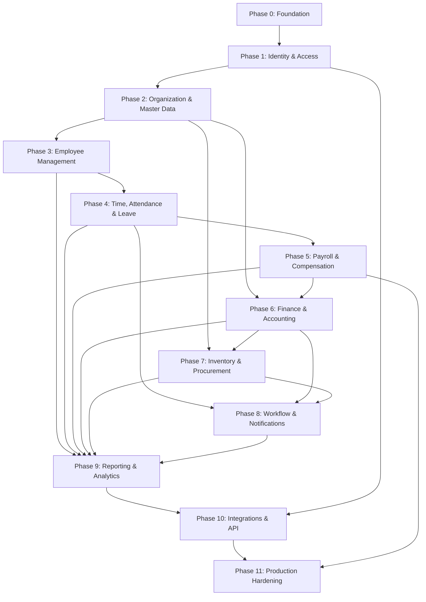

# HR Shakya ERP — Development Roadmap

**Project:** HR Shakya ERP Platform  
**Status:** Living document — update when phases complete or priorities shift  
**Aligned with:** `.ai/constitution.md`  
**Last updated:** 2025-06-25

---

## Overview

This roadmap breaks the ERP platform into **logical, sequential phases**. Each phase builds on prior foundations. Phases may overlap at the edges (e.g., documentation runs continuously), but **dependencies must be satisfied before a phase is marked complete**.

### Guiding Sequence

```
Foundation → Identity & Tenancy → Organization → HR Core → Time & Leave
    → Payroll → Finance → Inventory → Reporting → Integrations → Production
```

### Phase Summary

| Phase | Name | Focus |
|-------|------|-------|
| 0 | Platform Foundation | Tooling, architecture, CI/CD, shared infrastructure |
| 1 | Identity & Access | Auth, RBAC, multi-tenancy, audit baseline |
| 2 | Organization & Master Data | Company structure, departments, locations, lookups |
| 3 | Employee Management | Employee lifecycle, documents, org assignment |
| 4 | Time, Attendance & Leave | Shifts, clock-in/out, leave policies, approvals |
| 5 | Payroll & Compensation | Salary structures, payroll runs, payslips, tax |
| 6 | Finance & Accounting | Chart of accounts, invoices, payments, expenses |
| 7 | Inventory & Procurement | Items, stock, purchase orders, suppliers |
| 8 | Workflow, Notifications & Documents | Approvals engine, email/SMS, file storage |
| 9 | Reporting & Analytics | Dashboards, exports, compliance reports |
| 10 | Integrations & API Platform | Webhooks, third-party connectors, public API |
| 11 | Production Hardening & Scale | Performance, security audit, observability, DR |

---

## Phase 0 — Platform Foundation

### Objectives

- Establish the technical skeleton every future module depends on
- Enforce Clean Architecture, TypeScript strict mode, and standardized patterns from day one
- Enable local development, automated testing, and CI from the first merge

### Modules

| Module | Scope |
|--------|-------|
| `shared` | Error hierarchy, response envelope, constants, base types, validators |
| `config` | Typed environment configuration loader |
| `infrastructure/database` | PostgreSQL connection, migration tooling, transaction helper |
| `infrastructure/redis` | Redis client adapter with key naming and TTL conventions |
| `infrastructure/queue` | BullMQ connection, base job wrapper, dead-letter handling |
| `middleware` | Correlation ID, global error handler, request logging |
| `health` | Liveness and readiness endpoints |

### Dependencies

- None — this is the root phase
- Requires: Node.js runtime, PostgreSQL, Redis (local or Docker Compose)

### Expected Deliverables

- Repository scaffold matching constitution folder structure (`src/modules`, `src/shared`, `src/infrastructure`)
- TypeScript project with `strict: true`, ESLint, Prettier, path aliases
- Database migration framework with initial empty migration pipeline
- Redis and BullMQ infrastructure adapters (no business jobs yet)
- Standardized API response envelope and global error handler
- Custom error classes (`ValidationError`, `NotFoundError`, etc.)
- Structured JSON logging with correlation ID propagation
- Health check endpoints: `GET /health`, `GET /health/ready`
- Docker Compose for local PostgreSQL + Redis
- CI pipeline: lint, typecheck, unit test skeleton
- `.ai/architecture.md` documenting layer diagram and bootstrap flow
- `.ai/database.md` with connection and migration conventions
- `.env.example` with all required variables documented

### Completion Criteria

- [ ] Application boots without errors against local Docker Compose stack
- [ ] Health endpoints return correct status when DB/Redis are up/down
- [ ] Global error handler returns constitution-compliant error envelope
- [ ] Sample integration test proves DB connectivity and migration run
- [ ] CI passes on main branch
- [ ] All `.ai/` foundation docs updated (`architecture.md`, `database.md`, `memory.md`, `changelog.md`)
- [ ] No `any` types; strict TypeScript enforced in CI

---

## Phase 1 — Identity & Access Management

### Objectives

- Secure the platform with authentication, authorization, and multi-tenant isolation
- Establish RBAC as the permission model for all future modules
- Create audit logging baseline for security-sensitive actions

### Modules

| Module | Scope |
|--------|-------|
| `auth` | Login, logout, token refresh, password reset, session/token management |
| `users` | User accounts, profile, status (active/inactive/locked) |
| `roles` | Role definitions, permission assignment |
| `permissions` | Permission constants registry, permission check service |
| `tenants` | Tenant registration, tenant context resolution, tenant-scoped queries |
| `audit` | Audit log entity, write service, query API for admins |

### Dependencies

- **Phase 0** complete (database, Redis, error handling, logging)

### Expected Deliverables

- JWT (or session token) authentication with secure refresh flow
- RBAC: roles → permissions mapping stored in database
- `@RequirePermission()` or equivalent guard/middleware pattern
- Multi-tenant middleware: resolve `tenantId` from token/subdomain/header
- Row-level tenant isolation enforced at repository layer (`tenant_id` on all tables)
- User CRUD APIs: create, list, update, deactivate (admin only)
- Role and permission management APIs
- Login rate limiting via Redis
- Audit log for: login success/failure, logout, permission denied, user/role changes
- Swagger documentation for all auth and user endpoints
- Seed script: default tenant, super-admin role, baseline permissions
- `.ai/api.md` entries for auth and user modules
- `.ai/modules.md` entries for auth, users, roles, tenants, audit

### Completion Criteria

- [ ] Unauthenticated requests to protected routes return `401`
- [ ] Authenticated user without permission returns `403`
- [ ] All queries scoped to tenant — cross-tenant data access impossible in tests
- [ ] Token refresh and logout invalidate sessions correctly
- [ ] Rate limiting blocks brute-force login attempts
- [ ] Audit log records all required security events with correlation ID
- [ ] Integration tests cover auth flows and permission enforcement
- [ ] Swagger spec complete for Phase 1 endpoints

---

## Phase 2 — Organization & Master Data

### Objectives

- Model the organizational hierarchy every HR and finance module references
- Centralize reference/lookup data to avoid duplication across modules
- Provide admin APIs to configure company structure before employee onboarding

### Modules

| Module | Scope |
|--------|-------|
| `organization` | Legal entities, business units, company profile |
| `departments` | Department tree, cost centers |
| `locations` | Offices, branches, remote locations, addresses |
| `designations` | Job titles, grades, levels |
| `lookups` | Generic reference data (employment types, genders, countries, currencies) |
| `holidays` | Public and company holiday calendar per location/tenant |

### Dependencies

- **Phase 1** complete (auth, RBAC, multi-tenancy, audit)

### Expected Deliverables

- Database schema: organizations, departments (self-referential tree), locations, designations, lookup tables, holidays
- CRUD APIs for all master data entities with pagination and filtering
- Hierarchical department API (tree/list views)
- Soft delete on master data where audit requirements apply
- Validation: no circular department references; unique codes per tenant
- Redis caching for slow-changing lookups (countries, employment types) with TTL and invalidation
- Admin-only write access; read access for authenticated users with appropriate permissions
- Bulk import endpoint for holidays (CSV) via BullMQ job (first real queue usage)
- Swagger documentation for all master data endpoints
- `.ai/database.md` updated with ERD description for org structure
- `.ai/api.md` updated with master data endpoints

### Completion Criteria

- [ ] Full org hierarchy creatable via API for a new tenant
- [ ] Department tree returns correct nested structure
- [ ] Lookup data cached in Redis; cache invalidated on update
- [ ] Holiday calendar queryable by location and date range
- [ ] All master data tables include `tenant_id`, timestamps, and appropriate indexes
- [ ] Integration tests for CRUD, hierarchy validation, and tenant isolation
- [ ] Audit log records create/update/delete on master data

---

## Phase 3 — Employee Management

### Objectives

- Implement the core HR entity: the employee record and lifecycle
- Link employees to organization structure, users, and documents
- Support hire-to-active workflow as the foundation for payroll and attendance

### Modules

| Module | Scope |
|--------|-------|
| `employees` | Employee profile, employment details, status lifecycle |
| `employee-documents` | Document upload, categorization, expiry tracking |
| `employee-org` | Department, designation, location, reporting manager assignment |
| `employee-bank` | Bank account details for payroll (encrypted at rest) |

### Dependencies

- **Phase 2** complete (departments, designations, locations, lookups)
- **Phase 1** complete (users — optional link employee ↔ user account)

### Expected Deliverables

- Employee entity with status workflow: `Draft → Active → OnLeave → Suspended → Terminated`
- Employee CRUD APIs with search, filter (department, status, location), pagination
- Link employee to user account (optional, one-to-one)
- Reporting manager assignment with validation (no self-reporting, no circular chain)
- Employee document upload to object storage adapter (`infrastructure/storage`)
- Document types: ID proof, contract, certificate; expiry date alerts (queue job stub)
- Bank details API with field-level encryption
- Employee number auto-generation per tenant (configurable prefix/sequence)
- Bulk employee import via CSV (BullMQ job with progress reporting)
- Business audit log for all employee mutations
- Swagger documentation
- `.ai/modules.md` updated with employee module responsibilities

### Completion Criteria

- [ ] Employee lifecycle transitions enforced by service layer (invalid transitions rejected)
- [ ] Reporting manager hierarchy validated; circular references blocked
- [ ] Document upload, list, download, delete working with storage adapter
- [ ] Bank details never returned in plain text in logs or API without permission
- [ ] Bulk import job processes CSV idempotently with error report
- [ ] Employee list/search performs within p95 < 500ms for 10k records (indexed queries)
- [ ] Integration and unit tests for lifecycle, validation, and tenant isolation
- [ ] All employee endpoints permission-guarded

---

## Phase 4 — Time, Attendance & Leave

### Objectives

- Track employee working time and absences
- Implement leave policies, balances, and approval workflows
- Feed verified attendance and leave data into payroll (Phase 5)

### Modules

| Module | Scope |
|--------|-------|
| `shifts` | Shift definitions, schedules, assignments |
| `attendance` | Clock-in/out, manual corrections, overtime calculation |
| `leave-types` | Leave categories (annual, sick, unpaid, etc.) |
| `leave-policies` | Accrual rules, carry-forward, max balance, probation rules |
| `leave-requests` | Apply, approve, reject, cancel leave |
| `leave-balances` | Balance ledger per employee per leave type |

### Dependencies

- **Phase 3** complete (employees, org assignment)
- **Phase 2** complete (holidays — excluded from working day calculations)

### Expected Deliverables

- Shift and schedule management APIs
- Attendance recording: web/mobile clock-in/out, manual entry (manager), bulk import
- Overtime rules engine (configurable per tenant)
- Leave type and policy configuration APIs
- Leave request workflow: `Pending → Approved | Rejected | Cancelled`
- Multi-level approval support (reporting manager → HR) via approval service stub (full engine in Phase 8)
- Leave balance accrual job (BullMQ scheduled): monthly/annual accrual per policy
- Attendance summary API: daily, weekly, monthly per employee/department
- Integration points: export attendance/leave summary DTO for payroll consumption
- Redis lock for concurrent clock-in/out per employee
- Swagger documentation
- `.ai/database.md` updated with attendance and leave schema

### Completion Criteria

- [ ] Clock-in/out idempotent; duplicate same-day entries handled correctly
- [ ] Leave request validates balance, overlapping dates, and holidays
- [ ] Approved leave deducts balance; rejected/cancelled restores balance
- [ ] Accrual job runs on schedule and is idempotent
- [ ] Attendance summary matches raw clock records for test scenarios
- [ ] Overtime calculated per configured rules with unit tests
- [ ] Manager can only act on direct/indirect reports (authorization tested)
- [ ] All mutations audit-logged

---

## Phase 5 — Payroll & Compensation

### Objectives

- Calculate and process employee compensation accurately and audibly
- Generate payslips and maintain payroll history
- Integrate attendance and leave data into pay calculations

### Modules

| Module | Scope |
|--------|-------|
| `salary-structures` | Components (basic, HRA, allowances, deductions) |
| `employee-compensation` | Assign salary structure to employee, revision history |
| `payroll-runs` | Monthly/on-cycle payroll execution |
| `payslips` | Generated payslip records and PDF output |
| `tax-config` | Tax slabs, statutory deductions (region-configurable) |
| `payroll-adjustments` | One-off bonuses, deductions, arrears |

### Dependencies

- **Phase 4** complete (attendance, leave — for pro-rata and LOP calculations)
- **Phase 3** complete (employee bank details)
- **Phase 2** complete (lookups, currencies)

### Expected Deliverables

- Salary component model: earnings, deductions, employer contributions
- Employee compensation assignment with effective dates and revision history
- Payroll run workflow: `Draft → Processing → Completed → Finalized` (finalized = immutable)
- BullMQ job: `payroll.runMonthly` — async payroll calculation with progress
- Payslip PDF generation job (BullMQ) using template engine
- LOP (loss of pay) calculation from approved unpaid leave and attendance gaps
- Pro-rata salary for mid-month joiners/leavers
- Tax and statutory deduction calculation per tenant configuration
- Idempotency key required on payroll run creation and finalization
- Payroll register export (CSV/Excel) via async job
- Database transactions: entire employee payroll line items commit or rollback together
- Row-level locking on payroll run during processing
- Swagger documentation
- `.ai/decisions.md` ADR for payroll calculation precision (decimal handling)

### Completion Criteria

- [ ] Payroll run produces identical results on re-run of draft; finalized runs immutable
- [ ] Payslip totals match sum of components; rounding rules documented and tested
- [ ] LOP and pro-rata scenarios covered by unit tests with edge cases
- [ ] PDF payslip generated and stored; downloadable via API
- [ ] Full payroll run for 1,000 employees completes async without HTTP timeout
- [ ] Idempotency prevents duplicate payroll runs for same period
- [ ] Audit trail: who initiated, approved, finalized each payroll run
- [ ] Integration tests with sample attendance and leave data

---

## Phase 6 — Finance & Accounting

### Objectives

- Add core financial capabilities expected of an ERP: accounts, invoicing, payments
- Connect payroll outputs to accounting entries
- Enable expense tracking and basic financial reporting

### Modules

| Module | Scope |
|--------|-------|
| `chart-of-accounts` | Account hierarchy, account types |
| `journal-entries` | Double-entry bookkeeping, posting |
| `invoices` | Customer invoices, line items, statuses |
| `payments` | Payment recording, reconciliation |
| `expenses` | Employee expense claims, approval, reimbursement |
| `finance-reports` | Trial balance, ledger extract (basic) |

### Dependencies

- **Phase 5** complete (payroll — generate journal entries on finalization)
- **Phase 2** complete (organization entities, currencies)
- **Phase 1** complete (approval permissions)

### Expected Deliverables

- Chart of accounts CRUD with hierarchical structure
- Double-entry journal entry creation with balance validation (debits = credits)
- Automatic journal entry generation from finalized payroll runs
- Invoice lifecycle: `Draft → Sent → PartiallyPaid → Paid → Void`
- Payment recording with idempotency key
- Expense claim workflow: submit → approve → reimburse
- Link expense reimbursement to payroll adjustment or payment module
- Account balance queries as of date
- Basic trial balance report API (sync for small datasets; async for large)
- Multi-currency support stub (single currency fully implemented; extensible schema)
- Swagger documentation
- `.ai/database.md` updated with finance schema
- `.ai/modules.md` updated with finance module boundaries

### Completion Criteria

- [ ] Journal entries always balance; unbalanced entries rejected
- [ ] Payroll finalization creates correct journal entries (tested with fixtures)
- [ ] Invoice payment updates status and account balances correctly
- [ ] Expense approval triggers reimbursement workflow
- [ ] No partial journal posting — transaction integrity maintained
- [ ] Financial mutations require elevated permissions
- [ ] Idempotency on payment and journal entry creation tested
- [ ] Audit log covers all financial mutations

---

## Phase 7 — Inventory & Procurement

### Objectives

- Manage stock, items, and purchasing — standard ERP capability
- Support asset/inventory tracking optionally linked to departments and employees
- Integrate procurement with finance (payables)

### Modules

| Module | Scope |
|--------|-------|
| `items` | Item master, categories, units of measure |
| `warehouses` | Warehouse/location stock points |
| `stock` | Stock levels, movements, adjustments |
| `suppliers` | Supplier master data |
| `purchase-orders` | PO lifecycle, goods receipt |
| `stock-alerts` | Low stock notification job |

### Dependencies

- **Phase 6** complete (journal entries for stock valuation and PO payments)
- **Phase 2** complete (locations, lookups)

### Expected Deliverables

- Item master with SKU, barcode, category, reorder level
- Warehouse management and stock level tracking
- Stock movement types: receipt, issue, transfer, adjustment
- Optimistic or pessimistic locking on stock updates (constitution: document choice in ADR)
- Purchase order workflow: `Draft → Approved → PartiallyReceived → Received → Closed`
- Goods receipt updates stock levels in transaction
- Supplier CRUD and link to purchase orders
- Low stock alert BullMQ scheduled job with notification stub
- Stock valuation method configured per tenant (FIFO stub or weighted average)
- Integration: PO receipt → journal entry (finance module service call)
- Swagger documentation

### Completion Criteria

- [ ] Stock levels accurate after concurrent receipt/issue operations (concurrency tested)
- [ ] PO cannot receive more than ordered quantity
- [ ] Stock adjustment requires authorization and audit entry
- [ ] Negative stock prevented unless tenant config explicitly allows
- [ ] Finance integration creates correct journal entries on receipt
- [ ] Low stock job fires and is idempotent
- [ ] Integration tests for full PO → receipt → stock → finance flow

---

## Phase 8 — Workflow, Notifications & Documents

### Objectives

- Centralize approval workflows used across leave, expenses, POs, and payroll
- Deliver reliable async notifications (email, in-app)
- Mature document management beyond employee documents

### Modules

| Module | Scope |
|--------|-------|
| `workflows` | Configurable approval chains, delegation, escalation |
| `notifications` | In-app notifications, read/unread state |
| `email` | Email dispatch via infrastructure adapter (BullMQ) |
| `templates` | Email/PDF/notification templates with variable substitution |
| `documents` | Generic document store with access control and versioning |

### Dependencies

- **Phase 4** complete (leave approvals — migrate to workflow engine)
- **Phase 6** complete (expense approvals)
- **Phase 7** complete (PO approvals)
- **Phase 0** complete (BullMQ, storage adapter)

### Expected Deliverables

- Workflow engine: define steps, approver rules (role, manager, specific user)
- Workflow instance tracking: pending step, history, comments
- Migrate leave, expense, and PO approvals to shared workflow service
- Notification entity and API: list, mark read, unread count
- Email queue: `notifications.sendEmail` job with retry and template rendering
- Template management API for admins
- Generic document service with versioning and permission checks
- Escalation job: pending approvals beyond SLA notify next level
- Unsubscribe and rate limit on notification emails
- `.ai/decisions.md` ADR for workflow engine design

### Completion Criteria

- [ ] Leave, expense, and PO modules use workflow service — no inline approval logic remains
- [ ] Delegation: approver can delegate during absence
- [ ] Email job retries on failure; dead letter queue monitored
- [ ] Templates render variables correctly; HTML escaped to prevent injection
- [ ] Document versioning preserves history; old versions downloadable
- [ ] Escalation job tested with time-mocked scenarios
- [ ] Notification preferences respected per user

---

## Phase 9 — Reporting & Analytics

### Objectives

- Provide dashboards and exportable reports across HR, payroll, finance, and inventory
- Support compliance and management reporting requirements
- Offload heavy reports to async jobs

### Modules

| Module | Scope |
|--------|-------|
| `dashboards` | KPI widgets, role-based dashboard configs |
| `reports` | Report definitions, parameters, scheduling |
| `exports` | CSV, Excel, PDF export jobs |
| `analytics` | Aggregated metrics (headcount, attrition, payroll cost) |

### Dependencies

- **Phases 3–7** complete (data sources across modules)
- **Phase 8** complete (email delivery for scheduled reports)

### Expected Deliverables

- Dashboard API: headcount, attendance rate, leave liability, payroll summary, stock value
- Standard reports: employee roster, attendance register, leave balance, payroll register, trial balance, stock ledger
- Report execution: sync for small datasets (< 1,000 rows), async BullMQ job for large
- Scheduled reports: cron registration with email delivery of export link
- Export files stored in object storage with signed URL download
- Report permissions tied to RBAC
- Query optimization: indexed columns, read replica support documented if used
- Swagger documentation for report and dashboard endpoints

### Completion Criteria

- [ ] Dashboard KPIs match underlying module data in validation tests
- [ ] Large report runs async; client receives job ID and status endpoint
- [ ] Scheduled report executes on cron and delivers email with download link
- [ ] Exports respect tenant isolation and field-level permissions (no PII leakage)
- [ ] Report generation p95 documented; async threshold enforced
- [ ] At least 10 standard reports implemented and tested

---

## Phase 10 — Integrations & API Platform

### Objectives

- Expose a stable, versioned public API for third-party integrations
- Support webhooks for event-driven consumers
- Enable data import/export pipelines for migration and interoperability

### Modules

| Module | Scope |
|--------|-------|
| `webhooks` | Event subscription, delivery, retry, signature verification |
| `api-keys` | Service account keys with scoped permissions |
| `integrations` | Connector framework (accounting, biometric devices, banks) |
| `import-export` | Bulk data pipeline orchestration |

### Dependencies

- **Phase 9** complete (stable internal APIs and reports)
- **Phase 1** complete (RBAC — API key permissions)

### Expected Deliverables

- Webhook registry: subscribe to events (employee.created, payroll.finalized, etc.)
- Webhook delivery job with HMAC signature, exponential backoff, dead letter
- API key management: create, revoke, scope to permissions
- Public API rate limiting per API key via Redis
- OpenAPI 3.x spec published as versioned artifact (`/api/v1/`)
- Integration adapter interface with one reference implementation (e.g., CSV SFTP export)
- Bulk export/import orchestration for tenant migration
- Developer documentation in `.ai/api.md` (webhook catalog, API key usage)
- `.ai/decisions.md` ADR for webhook signature scheme

### Completion Criteria

- [ ] Webhook delivers within retry policy; failures visible in admin UI/log
- [ ] API keys authenticate and respect permission scopes
- [ ] Rate limiting returns `429` with retry-after header
- [ ] OpenAPI spec validates in CI; matches implemented endpoints
- [ ] Reference integration adapter passes contract tests
- [ ] Webhook and API key mutations audit-logged

---

## Phase 11 — Production Hardening & Scale

### Objectives

- Prepare the platform for production traffic, security scrutiny, and operational ownership
- Validate performance, disaster recovery, and observability
- Complete security and compliance baseline

### Modules

| Module | Scope |
|--------|-------|
| `observability` | Metrics, tracing, alerting hooks |
| `security` | Penetration test remediation, secrets rotation |
| `operations` | Runbooks, backup/restore, deployment automation |
| `performance` | Load testing, query optimization, caching audit |

### Dependencies

- **Phases 0–10** feature-complete for MVP scope
- All prior phase completion criteria met

### Expected Deliverables

- Application metrics: request latency, error rate, queue depth, job failure rate
- Distributed tracing with correlation ID integration
- Load test results documented (target: concurrent users, payroll batch size)
- Database backup and restore procedure tested
- Redis persistence and failover documented
- Secrets rotation runbook
- Security audit checklist completed; critical findings resolved
- Performance audit: N+1 queries eliminated, indexes verified, cache hit rates documented
- Production deployment pipeline (staging → production with approval gate)
- Disaster recovery plan in `.ai/architecture.md`
- SLA definitions for uptime, RPO, RTO

### Completion Criteria

- [ ] Load test meets p95 latency targets under expected peak load
- [ ] Backup restore successfully recreates database in staging
- [ ] Zero critical/high security vulnerabilities open
- [ ] Alerting configured for error spikes, queue backlog, DB connection exhaustion
- [ ] Production deployment executed successfully with rollback tested
- [ ] Runbooks reviewed and stored in repository docs
- [ ] All `.ai/` documentation current and accurate
- [ ] Definition of Done from constitution satisfied for all shipped modules

---

## Cross-Phase Concerns (Continuous)

These activities run throughout all phases — not deferred to the end.

| Concern | Requirement |
|---------|-------------|
| **Documentation** | Update `memory.md`, `changelog.md`, and relevant `.ai/` files every task |
| **Testing** | Unit tests for services; integration tests for endpoints; no decreasing coverage |
| **Swagger** | Updated in same PR as API changes |
| **Security** | Threat modeling for each module handling PII or financial data |
| **Audit logging** | All mutating operations on sensitive entities |
| **Code review** | Constitution checklist applied every PR |

---

## MVP Definition

Minimum viable product for initial launch — **Phases 0 through 5** plus selective Phase 8 capabilities:

| Included | Excluded (post-MVP) |
|----------|---------------------|
| Platform foundation | Full finance (Phase 6) |
| Auth, RBAC, multi-tenancy | Inventory (Phase 7) |
| Organization master data | Advanced analytics (Phase 9) |
| Employee management | Public API platform (Phase 10) |
| Time, attendance, leave | Full production hardening (Phase 11) |
| Payroll and payslips | |
| Basic email notifications | |
| Core Swagger docs | |

**MVP launch gate:** Phases 0–5 completion criteria met; basic notification emails working; security review of auth and payroll modules complete.

---

## Dependency Graph



---

## Phase Status Tracking

Update this table as phases progress.

| Phase | Status | Target | Completed |
|-------|--------|--------|-----------|
| 0 — Platform Foundation | Not started | TBD | — |
| 1 — Identity & Access | Not started | TBD | — |
| 2 — Organization & Master Data | Not started | TBD | — |
| 3 — Employee Management | Not started | TBD | — |
| 4 — Time, Attendance & Leave | Not started | TBD | — |
| 5 — Payroll & Compensation | Not started | TBD | — |
| 6 — Finance & Accounting | Not started | TBD | — |
| 7 — Inventory & Procurement | Not started | TBD | — |
| 8 — Workflow & Notifications | Not started | TBD | — |
| 9 — Reporting & Analytics | Not started | TBD | — |
| 10 — Integrations & API | Not started | TBD | — |
| 11 — Production Hardening | Not started | TBD | — |

**Status values:** `Not started` | `In progress` | `Complete` | `Blocked`

---

## Revision History

| Date | Change | Author |
|------|--------|--------|
| 2025-06-25 | Initial roadmap created | AI Agent |
